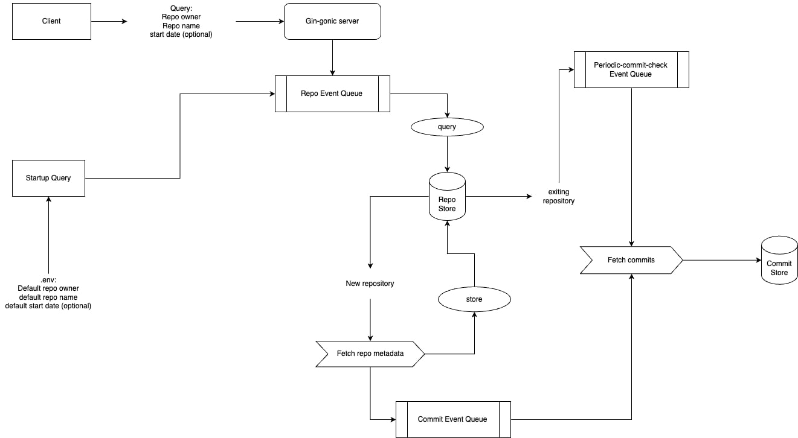

# GitHub Commit Tracker

GitHub Commit Tracker is an application designed to fetch and store commit data from GitHub repositories. It periodically checks for new commits, handles paginated responses, and stores the data in a PostgreSQL database. It also features functionality to fetch and display the top N commit authors based on commit counts.

## Table of Contents

- [GitHub Commit Tracker](#github-commit-tracker)
  - [Table of Contents](#table-of-contents)
  - [System Architecture](#system-architecture)
  - [Features](#features)
  - [Prerequisites](#prerequisites)
  - [How to Run GitHub Commit Tracker](#how-to-run-github-commit-tracker)
    - [Run with Docker Compose](#run-with-docker-compose)
    - [Run directly without Docker Compose](#run-directly-without-docker-compose)
  - [Usage](#usage)
    - [Fetching and Storing Commits](#fetching-and-storing-commits)
    - [Top Commit Author](#top-commit-author)
    - [Commits by Repository](#commits-by-repository)
  - [Error Handling](#error-handling)
  - [Testing](#testing)
  - [Feature Improvements](#feature-improvements)
  - [License](#license)
  
## System Architecture

The GitHub Commit Tracker system is designed with a modular, clean architecture pattern with a focus on separation of concerns and maintainability that includes the following components:



- **API Server**: The API server is responsible for handling incoming requests and returning responses. It uses the Gin web framework for routing and handling requests.
- **Redis Event Queue**: The Redis component is used for event queuing, utilising the Redis pub/sub feature.
- **Data Fetcher**: The data fetcher is responsible for fetching new commit data from GitHub repositories. It uses the GitHub API and go http client for making requests.
- **Data Store**: The data store is responsible for storing commit data in a PostgreSQL database. It uses the Gorm ORM for database operations.

The system uses channels to manage paginated responses and implements exponential backoff to handle GitHub API rate limiting.

## Features

- **Fetching**: The application fetches new commit data from GitHub repositories.
- **Repo Meta Data**: The application fetches and stores repository metadata such as the repository name, owner, and description.
- **Periodic Fetching**: The application periodically fetches new commit data from GitHub repositories.
- **Paginated Responses**: The application handles paginated responses from the GitHub API.
- **Retry Mechanism**: The application implements a retry mechanism to handle rate limiting using exponential backoff.
- **Commit Data Storage**: The application stores commit data in a PostgreSQL database.
- **Top Commit Author**: The application fetches and displays the top N commit authors based on commit counts.

## Prerequisites

Before installing GitHub Commit Tracker, ensure that you have the following prerequisites installed:

- Go 1.22 or higher
- Docker (Docker Compose)
- PostgreSQL 15 or higher (optional)

## How to Run GitHub Commit Tracker

To install GitHub Commit Tracker, follow these steps:

- **Clone the GitHub Commit Tracker repository:**

```bash
git clone https://github.com/Rhaqim/savannahtech.git
```

- **Change into the GitHub Commit Tracker directory:**

```bash
cd savannahtech
```

### Run with Docker Compose

- **Build the Docker image:**

```bash
docker-compose build
```

- **Start the application:**

```bash
docker-compose up -d
```

This will start the application and the PostgreSQL database in the background. It will run with the default configuration in the .env file.

### Run directly without Docker Compose

You will need to have a PostgreSQL database running and set the DATABASE_URL environment variable in the .env file.

- **Install Dependencies:**

```bash
go mod tidy
```

- **Set the environment variables in the .env file:**

GitHub Commit Tracker requires the following environment variables to be set:

- `DATABASE_URL`: The connection string for the PostgreSQL database.
- `SERVER_PORT`: The port on which the application will listen for incoming requests.
- `DEFAULT_OWNER`: The default owner of the default repository.
- `DEFAULT_REPO`: The default repository to track on application startup.
- `DEFAULT_START_DATE`: The default start date for fetching commit data. Should be in the format YYYY-MM-DD:HH:MM:SS e.g 2023-01-01:00:00:00
- `REFETCH_INTERVAL`: The interval at which the application should get new commit data. Example: 1h, 2d, 30m, etc.
  
> You can copy the `.env.example` file to `.env` and `modify` the values accordingly.

- **Start the application:**

```bash
go run main.go
```

## Usage

The application will start fetching commit data from the specified repository in the .env file and storing it in the PostgreSQL database.

### Fetching and Storing Commits

The application periodically fetches new commits from the configured GitHub repository that have been indexed and stores them in the PostgreSQL database. By default, this occurs every hour.

To fetch and store commits for a new repository, you can make a GET request to the `/repositories/get/:owner/:repo` endpoint.

> Optionally: You can specify a start date for fetching commits by adding the `start_date` query parameter. The start date should be in the format YYYY-MM-DD:HH:MM:SS e.g 2023-01-01:00:00:00

```curl
curl -X GET "http://localhost:8080/repositories/get/chromium/chromium?start_date=2023-01-01:00:00:00"
```

This will fetch and store the commits for the `chromium` repository owned by the `chromium` user.

### Top Commit Author

You can retrieve the top N commit authors using the GetTopCommitAuthors function.

```curl
curl -X GET "http://localhost:8080/commits/top-authors?n=10"
```

This will retrieve the top 10 commit authors based on the commit counts.

### Commits by Repository

You can retrieve the commits by repository using the GetCommitsByRepository function. The responses are paginated, so you can specify the page number and page size to retrieve the desired number of commits.

```curl
curl -X GET "http://localhost:8080/commits/chromium?page=1&page_size=10"
```

This will retrieve the commits for the `chromium` repository.

## Error Handling

If an error occurs during the execution of the application, it will return a 500 status code with a JSON response containing an error message. Application errors are stored in the `error` file in the logs directory.

## Testing

All the tests are located in the `internal/test` directory. To run the tests, use the following command:

```bash
go test -v ./internal/test/...
```

## Feature Improvements

The following improvements are planned for future releases:

- Restart the period fetcher for all repositories in the database
- Fetch multiple repositories at once on startup

## License

GitHub Commit Tracker is licensed under the MIT License. See the [LICENSE](LICENSE) file for more information.
